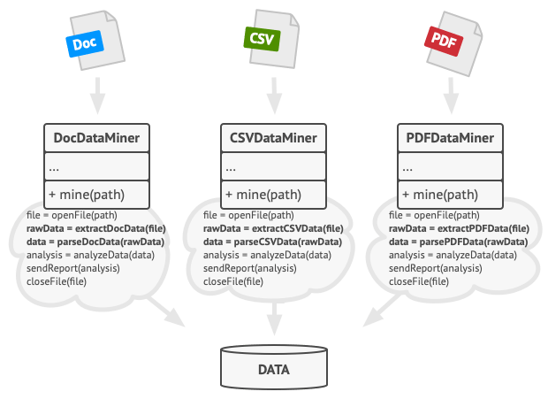
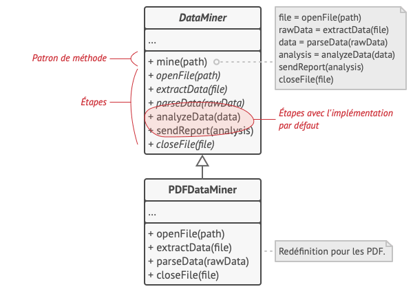

# Patron de méthode
## Intention
> Patron de Méthode est un patron de conception comportemental qui permet de mettre le squelette d’un algorithme dans la classe mère, mais laisse les sous-classes redéfinir certaines étapes de l’algorithme sans changer sa structure.

## Solution
> Le patron de méthode vous propose de découper un algorithme en une série d’étapes, de transformer ces étapes en méthodes et de mettre l’ensemble des appels à ces méthodes dans une seule méthode socle, le patron de méthode. Les étapes peuvent être abstraites ou avoir une implémentation par défaut. Pour utiliser l’algorithme, le client doit fournir sa propre sous-classe, implémenter toutes les étapes abstraites et redéfinir certaines d’entre elles si besoin (mais pas la méthode socle elle-même).

## Avantages

- Vous permettez aux clients de redéfinir certaines parties d’un grand algorithme. Elles sont ainsi moins affectées par les modifications apportées aux autres parties de l’algorithme.
- Vous pouvez remonter le code dupliqué dans la classe mère.

## Inconvénients
- Certains clients peuvent être limités à cause du squelette de l’algorithme.
Vous ne respectez pas le Principe de substitution de Liskov, si vous supprimez l’implémentation d’une étape par défaut dans une sous-classe.
- Plus vous avez d’étapes, plus le patron de méthode devient difficile à maintenir.

## Alternatives
- De nombreux langages de programmation modernes gèrent les types fonctionnels et vous permettent d’implémenter différentes versions d’un algorithme à l’intérieur d’un ensemble de fonctions anonymes. Vous pouvez ensuite utiliser ces fonctions exactement comme vous le feriez pour des objets stratégie, sans encombrer votre code avec des classes et interfaces supplémentaires.

