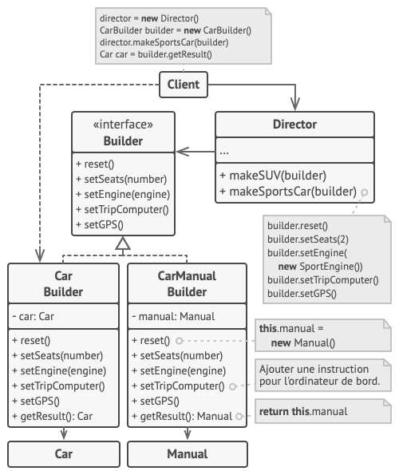

# Builder
## Intention
> Monteur est un patron de conception de création qui permet de construire des objets complexes étape par étape. Il permet de produire différentes variations ou représentations d’un objet en utilisant le même code de construction.

## Solution
> Le patron de conception monteur propose d’extraire le code du constructeur d’objet de sa classe et de le déplacer dans des objets distincts appelés monteurs.

## Directeur (Director)

## Possibilités d’application
<b>Utilisez le patron de conception monteur afin de vous débarrasser d’un « constructeur télescopique ».</b>

Prenons un constructeur avec dix paramètres facultatifs. Faire un appel à cette monstruosité n’est pas très pratique : vous surchargez le constructeur avec plusieurs petites versions, mais avec moins de paramètres. Ces constructeurs font toujours référence au constructeur principal en donnant des valeurs par défaut aux paramètres optionnels.

Le monteur vous permet de créer des objets étape par étape, en utilisant uniquement celles qui sont nécessaires. Après avoir implémenté le patron, vous n’avez plus besoin d’entasser les paramètres dans vos constructeurs.

<b> Utilisez le monteur pour rendre votre code capable de créer différentes représentations de produits (par exemple des maisons en pierre et en bois).</b>

Le monteur est utile lorsque les étapes de la construction des différentes représentations du produit se ressemblent (seuls quelques détails diffèrent).

Le monteur ne met pas à disposition le produit tant que les étapes de la construction ne sont pas terminées. Par conséquent, le code client ne récupèrera jamais un résultat incomplet.

## Avantages

- Vous pouvez construire les objets étape par étape et les déléguer ou les exécuter récursivement.
-  Vous pouvez réutiliser le même code de construction lorsque vous construisez différentes représentations des produits.
- Principe de responsabilité unique. Vous pouvez découpler le code complexe de la construction et la logique métier du produit.

## Inconvénients
- Le monteur nécessite de créer beaucoup nouvelles classes, ce qui accroit la complexité générale du code.

